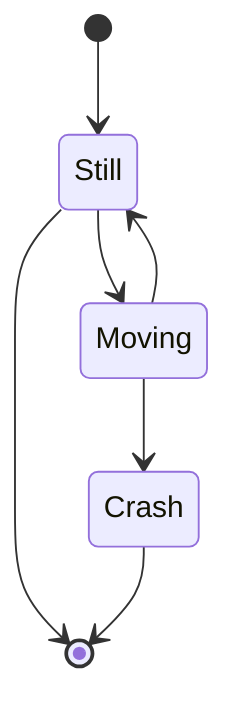

# release-experimental

GitHub Actions の `release` のイベントについて調べます。

`release` のイベントは対象の Repository の Release の作成・変更・削除などによってトリガーされます。

## Release イベントの Activity type

Activity type には以下の種類があります。

- `published`
- `unpublished`
- `created`
- `edited`
- `deleted`
- `prereleased`
- `released`

Activity type | 説明
--|--
`published` | a
`unpublished` | a
`created` | a
`edited` | a
`deleted` | a
`prereleased` | a
`released` | a

以下を参考に、Release の状態変化とそれに伴う 
https://docs.github.com/ja/actions/writing-workflows/choosing-when-your-workflow-runs/events-that-trigger-workflows#release

