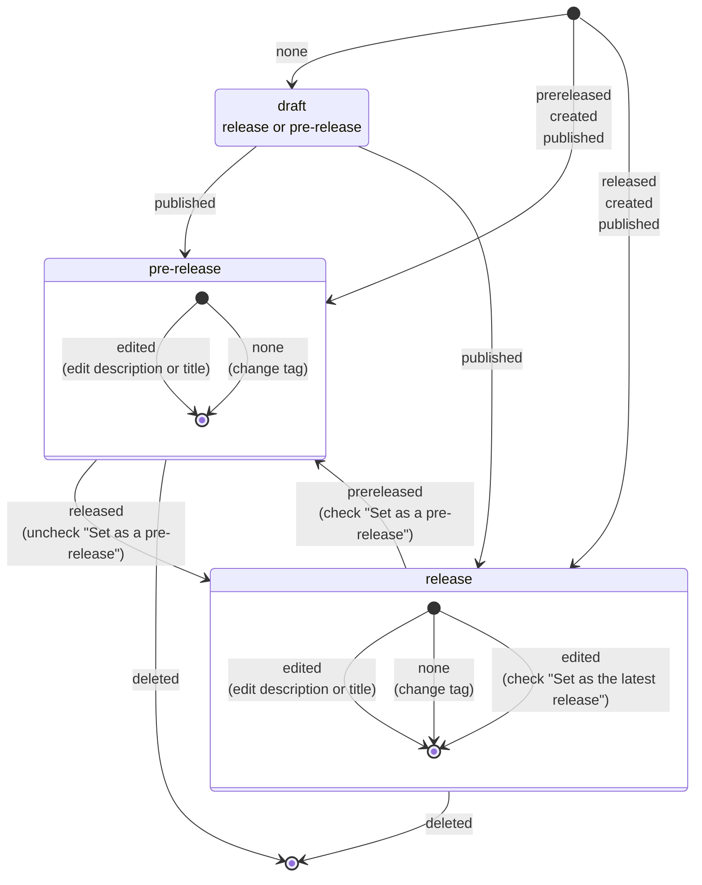

# release-experimental

GitHub Actions の `release` のイベントについて調べます。

`release` のイベントは対象の Repository の Release の作成・変更・削除などによってトリガーされます。

## Release イベントの Activity type

以下を参考に、Release の状態変化とそれにトリガーされるイベントをまとめる。

https://docs.github.com/ja/actions/writing-workflows/choosing-when-your-workflow-runs/events-that-trigger-workflows#release

### Latest release の変更について

２つ以上の Release がある状態で、現在 `Latest Release` ではない方の Release の `Set as the latest release` にチェックして更新すると、 `release.edit` のワークフローがトリガーされる。

**その際の `${{ github.event.action }}` は、これから `Latest` となる方のブランチ（タグ）になる。**

もともと `Latest` で、これからそうでなくなる方からはワークフローはトリガーされない。

### unpublish について

`release` には `unpublish` という Activity type (action) が定義されているが、 GitHub の UI 上の操作からは発生させる方法を見つけられなかった。